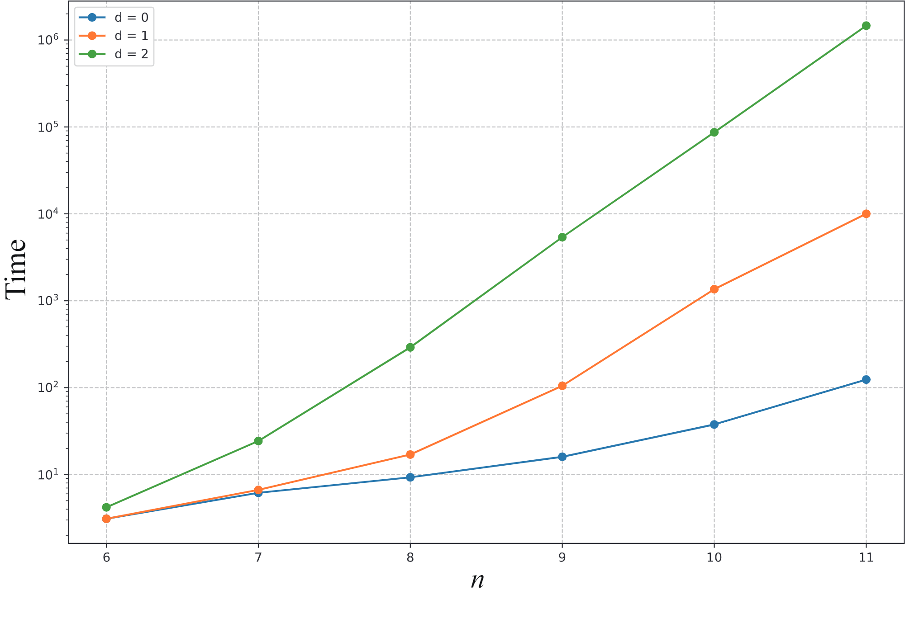

## Runtime Results with various d_j  
Each entry reads (time)

|  Functions |      d=0      |      d=1      |      d=2      |      d=3      |      d=4      |      d=5      |..., d_i = ,... |
|    ----    |      ----     |     ----      |     ----      |     ----      |     ----      |     ----      |      ----                    |
| nthprime3  | < 1s          | < 1s          | < 1s          |       -       |       -       |       -       |        -                     |
| nthprime4  | < 1s          | < 1s          | < 1s          |       -       |       -       |       -       |        -                     |
| nthprime5  | < 1s          | < 1s          | < 1s          |       -       |       -       |       -       |        -                     |
| nthprime6  | 3.3s          | 3.5s          | 4.1s          |       -       |       -       |       -       |        -                     |
| nthprime7  |  6.2s         | 6.7s          | 24s           | 6m 37s        | 2h 32m 21s    | 2d 12h 18m    |        -                     |
| nthprime8  |  9.3s         | 17s           | 4m 51s        | 3h 27m 1s     | 7d 28m        |       -       |        -                     |
| nthprime9  |  16.0s        | 1m 45s        | 1m 29m 44s    | 5d 14h 37m    |       -       |       -       |        -                     |
| nthprime10 |  37.7s        | 22m 38s       | 1d 5m         |       -       |       -       |       -       |        -                     |
| nthprime11 |  2m 3.9s      | 2h 46m 55s    | 16d 22h 2m    |       -       |       -       |       -       |        -                     |
| nthprime12 |  8m 31s       | 1d 10h 31m    |       -       |       -       |       -       |       -       |        -                     |
| nthprime13 |       -       |       -       |       -       |       -       |       -       |       -       |      TBA                     |
| nthprime14 |       -       |       -       |       -       |       -       |       -       |       -       |      TBA                     |
| nthprime15 |       -       |       -       |       -       |       -       |       -       |       -       |      TBA                     |
| nthprime16 |       -       |       -       |       -       |       -       |       -       |       -       |      TBA                     |

## Runtime Results Graph with d=0,1,2 and nthPrime6 to nthPrime11

